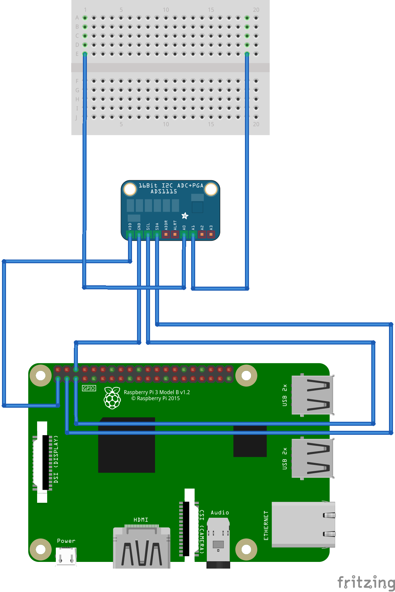

# Pascal library for ADS1115 on Raspberry Pi 3B

### Description
This is a Pascal library for FPC/LAZARUS/CODETYPHON for the Raspberry Pi running on Raspian.
It was developed under Codetyphon 6.7, fpc 3.3.1, Raspberry Pi 3B and Raspian Stretch.
The main file is ads1115_unit.pas, which contains all code for the programming of the I²C-Bus and the ADS1115. 
This source code was developed for a seismometer project. 
More information at http://www.seismometer.info.

### Connection
The following connection is used between ads1115 and the Raspberry Pi:

 

### Hardware
The ADS1115 breakout board is a simple breakout board from china and can be ordered from AMAZON for about 4 Euro. 

### Source Code
The source code was developed with codetyphon on the Raspberry Pi 3B, but should also work with Lazarus.

### Compiling
The file go.sh can be used for compiling, please check the path inside go.sh and adept it to your own source path.

### License
GNU LESSER GENERAL PUBLIC LICENSE Version 3, 29 June 2007

### Contact
Author  : Dr. Jürgen Abel 
Website : https://www.juergen-abel.info/ 
